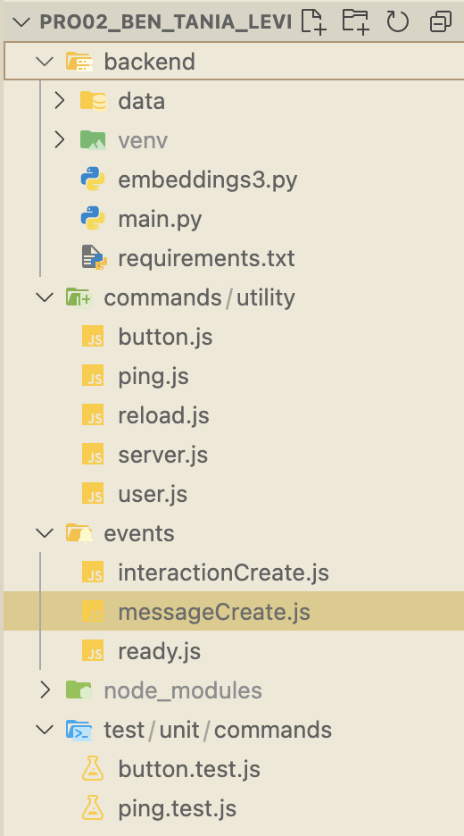
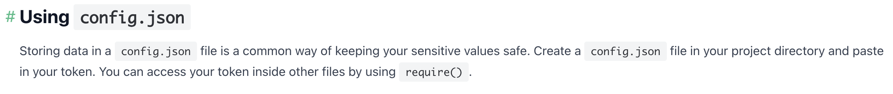
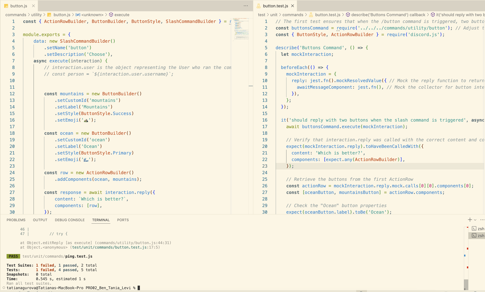
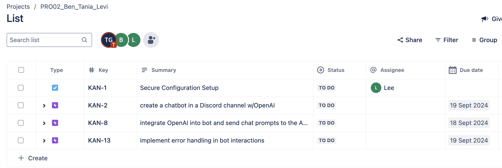
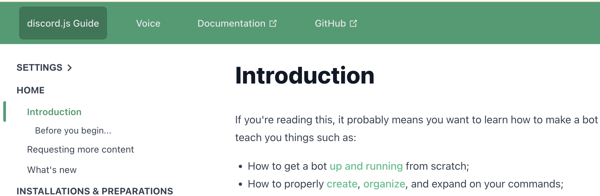

## Guidance
Answer the following questions considering the learning outcomes for
- [Week 02](https://learn.foundersandcoders.com/course/syllabus/developer/week02-project02-chatbot/learning-outcomes/)

Make sure to record evidence of your processes. You can use code snippets, screenshots or any other material to support your answers.

Do not fill in the feedback section. The Founders and Coders team will update this with feedback on your progress.

## Assessment
 ### 1. Show evidence of some of the learning outcomes you have achieved this week.

- I learned how backend development works, how code is written on the backend, and how functions can be passed as modules to other files for reuse.

```
const { Events } = require('discord.js');
const { ask } = require("../ai.js");

module.exports = {
	name: Events.MessageCreate, 
	async execute(client, message) {
		if (message.content.startsWith("!")) {
			try {
				const prompt = message.content;
				const answer = await ask(prompt); 
				const channel = await client.channels.fetch(message.channelId);
				await channel.send(answer);  // Send the response back to the Discord channel
			} catch (error) {
				console.error('Error handling message:', error);
			}
		}
	}
};
```


- Our team planned a new folder structure that turned out to be more logical.



- I now understand how to work with `.env` and configuration files—these are files used to store sensitive passwords, and they can be accessed using `require` or `dotenv`. I also learned how `.gitignore` works in this situation, ensuring these files are not included when submitting a PR.



- Thanks to working with Ben and Levi, I gained a deeper understanding of how DevOps is structured. Although I had completed a DevOps course previously, working on a real project has made the concepts much clearer. During this project, Levi attempted to deploy the project on AWS, ensuring all sensitive passwords were securely stored in an EC2 instance, with access limited to team members.


- I experimented with unit testing for this project. I tested two commands to verify that the actual results matched the expected outcomes.



- I planned and broke down tasks in Jira for the first time. It didn’t seem much different from GitHub Projects, but I suspect I haven’t yet fully explored Jira’s capabilities.


Additionally, I learned a lot from other team members. For example, I discovered that it’s possible to combine Node.js and Python in the same backend project, something I hadn’t thought possible before. I also found out that OpenAI can have a customizable personality, though I wasn’t directly involved in this, so I’m not listing it as one of my achievements, but it was new information for me.


 ### 2. Show an example of some of the learning outcomes you have struggled with and/or would like to re-visit.

- I definitely need to start from scratch and go through each step again to create a Discord bot using Node.js, OpenAI, and Discord.js. It still feels like a complex and large topic that I could experiment with for a long time and eventually build something really cool.


- I need to spend more time working with Node.js (and backend development in general) to better understand how to write code in Node.js.

- I need to get more comfortable with `try{}` and `catch{}` blocks, especially the `catch` part. While I understand the logic behind it, writing it on my own always makes me hesitate.

```
try {
			await command.execute(interaction);
		} catch (error) {
			console.error(error);
			if (interaction.replied || interaction.deferred) {
				await interaction.followUp({ content: 'There was an error while executing this command!', ephemeral: true });
			} else {
				await interaction.reply({ content: 'There was an error while executing this command!', ephemeral: true });
			}
		}
```

- I want to practice integration testing more.
```
test("Uppercases the user's input and updates the page", () => {
  const input = document.querySelector("input"); // step 1
  input.value = "test"; // step 2
  const submitButton = document.querySelector("button[type='submit']");
  submitButton.click(); // step 3
  const result = document.querySelector("#result");
  equal(result.textContent, "TEST"); // step 4
  result.textContent = ""; // reset the page so it doesn't affect the page/other tests
});
```

- I want to understand how to use `async/await` in practice, I mean try it to apply.


## Feedback (For CF's)
> [**Course Facilitator name**]  
> [*What went well*]  
> [*Even better if*]
