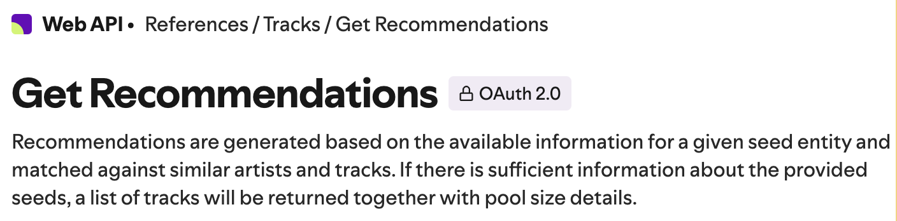

## Guidance
Answer the following questions considering the learning outcomes for
- [Week 03](https://learn.foundersandcoders.com/course/syllabus/developer/week03-project03-server/learning-outcomes/)

Make sure to record evidence of your processes. You can use code snippets, screenshots or any other material to support your answers.

Do not fill in the feedback section. The Founders and Coders team will update this with feedback on your progress.

## Assessment
 ### 1. Show evidence of some of the learning outcomes you have achieved this week.
- Studied basic TypeScript, which significantly helped me understand a part of the project where we integrated interfaces for input and output data with the API.
```
import { openaiQuery } from "../../types/openaiQuery.js";
import { openaiResponse } from "../../types/openaiResponse.js";
```

- Gained a deeper understanding of the OpenAI API, not just in terms of setup and connection, but also in terms of AI capabilities. For instance, I learned that in our case, it's not optimal to use 'Assistance API' or 'Function Calling', as their functionality is better suited for more complex tasks.

- During my research, I discovered many other APIs that could assist with part of our task (such as converting text into emotions). However, these alternatives also require paid versions and only solve part of the problem, rather than the entire task.
Example: VADER(sentiment Analysis Lybraries) or GoEmotions.

- Learned about and successfully applied OpenAI's Embedding API, which currently seems to be the best solution for our needs.


- Briefly explored the Spotify API to understand how data exchange between the two APIs would work and what is required for that integration.



 ### 2. Show an example of some learning outcomes you have struggled with and/or would like to re-visit.
- It took a considerable amount of time to figure out how to translate emotional text expressions into the attributes needed for playlist creation. A lot of time was spent searching for the right tool (which turned out to be OpenAI’s Embedding API) and testing the results.

- I would like to revisit the current implementation of this mechanism and make it more efficient by saving the embeddings in a separate JSON file to improve performance.

## Feedback (For CF's)
> [**Course Facilitator name**]

Alexander

> [*What went well*]

You used openAI api in a very sophisticated way. Using embedings in your project is great and definetly something that you should add to your personal portfolio.

> [*Even better if*]

It may be more useful to give a few short specifics than one big topic. You can peak Jason's PLog Week03, it is a good balance.
