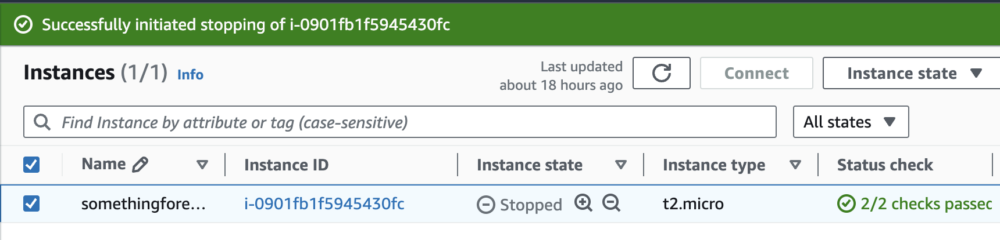
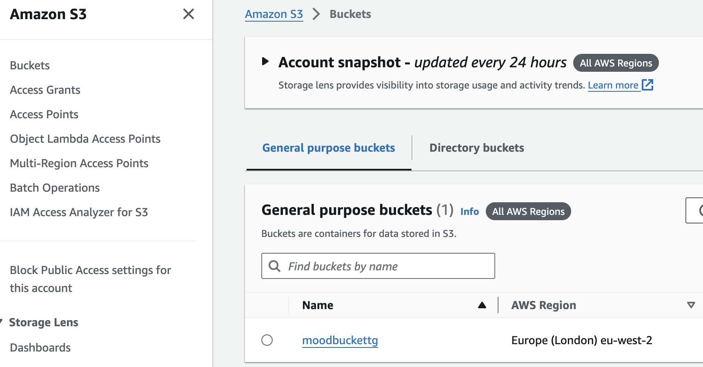
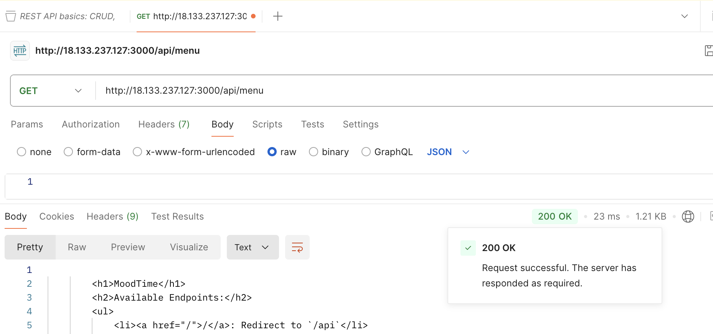
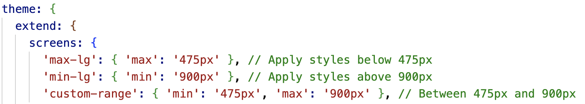

## Guidance
Answer the following questions considering the learning outcomes for
- [Week 05](https://learn.foundersandcoders.com/course/syllabus/developer/week05-project03-test-deploy/learning-outcomes/)

Make sure to record evidence of your processes. You can use code snippets, screenshots or any other material to support your answers.

Do not fill in the feedback section. The Founders and Coders team will update this with feedback on your progress.

## Assessment
 ### 1. Show evidence of some of the learning outcomes you have achieved this week. I learned:
- how **to deploy a backend to an AWS EC2 Instance** using a .env file to store secret keys. The .env file was added to .gitignore to keep the keys secure, and everything worked as expected.

- how **to upload a frontend to an AWS S3 Bucket**. I found the process very interesting and really enjoyed the deployment experience. I didn't do it with our project this week but with the my own one.

- how to use **Postman** and its purpose. After deploying our backend on the EC2 Instance, I was able to test our API endpoints using Postman.

- **Cypress** testing during a workshop. I haven’t applied it in our project but I found this end-to-end framework uncomplicated and am eager to try it out.

- how **to implement media queries in Tailwind** by configuring the Tailwind.config.js file. I can define custom breakpoints and styles for different screen sizes by extending screen sizes, ensuring components adjust dynamically as the screen size changes.

- **Accessibility for the web app**: 
After attending a lecture by Laurie on Thursday, I gained a much better understanding of web accessibility and its importance. What I remember: it’s crucial to always have an H1 tag on every page that conveys the most important information. Subsequent headings like H2, H3, etc., should help structure the page for easy navigation, especially for keyboard users; Button clickability, easy navigation between pages, and providing users with options to exit or go back are essential; Every image or visual element should have alt text describing what’s happening on the screen for better accessibility.

- how important it is **not to call different branches by the same name**: After pushing my pull request from my local repository, some errors occurred. To resolve this, I deleted my local repository and cloned a fresh copy from main. I then created a new branch but mistakenly gave it the same name as the branch in my old repository. When I tried pushing from this new branch, I ran into a conflict, which wasn’t producing clear error messages. It turns out that the conflict arose because the new branch had the same name as the old one. Once I renamed the branch, everything worked perfectly, and I could push my changes. 

 ### 2. Show an example of some of the learning outcomes you have struggled with and/or would like to re-visit.
- **Merge Conflicts**: The biggest challenge this week was dealing with merge conflicts, particularly because we were working on the same file at the same time. When merging, we encountered strange conflicts, especially related to renaming components(on the front end). This misunderstanding of GitHub’s case sensitivity and ours as well caused confusion and issues during the pull process.

- I would also like to go through the process of deploying the backend on an AWS EC2 Instance again to solidify my understanding. This time, I want **to use the Secrets Manager service**, which I haven’t tried yet. I believe this would not only be a valuable experience to add to my skill set but also a challenge, as there might be complexities that I haven’t encountered before. Revisiting this would help me better understand those potential issues and improve my deployment skills. 

- Another significant struggle was realizing that **fixing styles is not as quick as I initially thought**. It takes time to understand where styles are inherited from, which elements are parents, and how parent styles affect child elements. Bringing the frontend design in line with our Figma plan proved to be a slower process than expected, especially when figuring out the cascading effects of styles.
## Feedback (For CF's)
> [**Course Facilitator name**]

Alexander

> [*What went well*]

Good understanding of deployment processes for both AWS EC2 and S3. Strong grasp of web accessibility principles with specific, practical examples. Clear lesson learned about Git branch naming conventions from actual experience.

> [*Even better if*]

Show code examples of your media query implementations in Tailwind since you mentioned learning it. Document your specific merge conflict issues with code to better track how you/team resolved them.
