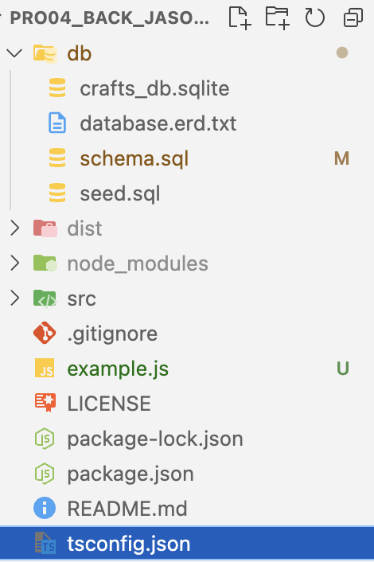
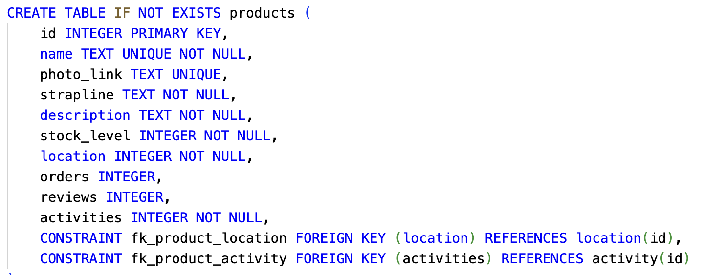
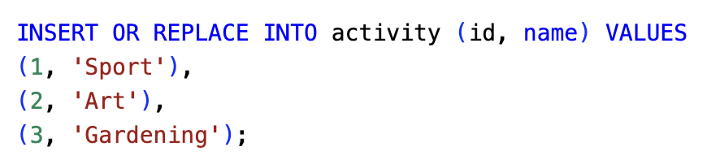
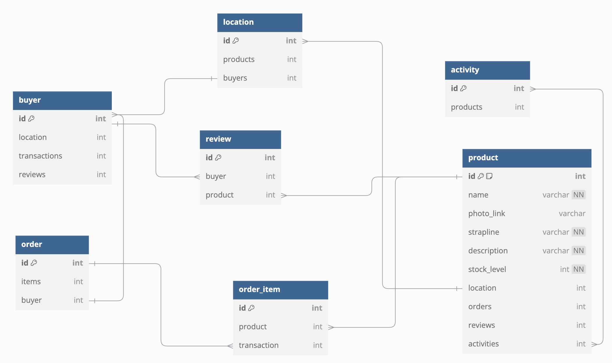

## Guidance
Answer the following questions considering the learning outcomes for
- [Week 06](https://learn.foundersandcoders.com/course/syllabus/developer/week06-project04-databases/learning-outcomes/)

Make sure to record evidence of your processes. You can use code snippets, screenshots or any other material to support your answers.

Do not fill in the feedback section. The Founders and Coders team will update this with feedback on your progress.

## Assessment
 ### 1. Show evidence of some of the learning outcomes you have achieved this week.
- I gained experience **setting up a backend using Node.js and Express.js**, and found the process to be fairly straightforward. Node.js is a runtime that enables JavaScript to run server-side, while Express.js, built on top of Node.js, simplifies building web applications and APIs.

- This week, I developed an app **using TypeScript and integrated SQLite as the database**. I set up a persistent SQLite connection, created the necessary database, and wrote a dbInit.ts file to handle table initialization. Additionally, I connected seed.ts to populate the tables with initial data.
```
import db from '../config/db';
import fs from 'fs';
import path from 'path';

const schema: string = fs.readFileSync(path.resolve(process.cwd(), 'db/schema.sql'), 'utf-8');

db.exec(schema, (err: Error | null) => {
  if (err) {
    console.error('Error creating tables:', err.message);
  } else {
    console.log('Tables created successfully or already exist.');
  }
});

export default db;
```

- I encountered an issue where **non-TypeScript files weren’t being transferred to the /dist folder** during the TypeScript compilation process. This caused my database-related files to be ignored. I resolved this by moving all the database files to a dedicated folder and updating the file paths accordingly in my TypeScript code.


- Working with databases taught me **the importance of understanding table dependencies and ensuring the correct order in defining them**. Primary keys must be established before foreign keys when working with dependent tables.


- I also learned some **useful practices for creating and seeding tables**. When creating tables, using IF NOT EXISTS helps avoid errors if the table already exists. For seeding, INSERT OR REPLACE INTO is handy for handling conflicts, such as duplicate primary keys or unique fields, by replacing the existing data instead of causing errors.


- I became more aware of **SQL injection vulnerabilities** and their potential danger. It’s crucial never to concatenate SQL strings when passing dynamic data in queries like INSERT or SELECT. Instead, always use bind parameters to avoid these security risks.


- Lastly, I **set up routes and controllers** in my app. The routes map HTTP requests to specific controller functions, which then handle the database interactions. This separation keeps the routes clean by leaving business logic to the controllers.
```
/** Example - Get all products */

/** ROUTE */
const router = express.Router();
router.get('/products', handleGetAllProducts);

/** CONTROLLER */
export const handleGetAllProducts = async (req: Request, res: Response): Promise<void> => {
    try {
        const products = await ItemModel.getAllProducts();  // Assuming this returns an array of products
        res.json(products);
    } catch (error) {
        res.status(500).json({ error: 'Failed to retrieve products' });
    }
};

/** MODEL */
const getAllProducts = (): Promise<Product[]> => {
    return new Promise((resolve, reject) => {
      const query = 'SELECT * FROM products';
      
      db.all(query, [], (err: Error | null, rows: Product[]) => {
        if (err) {
          reject(err);
        } else {
          resolve(rows);
        }
      });
    });
  };
```


 ### 2. Show an example of some of the learning outcomes you have struggled with and/or would like to re-visit.

- I found myself struggling a bit when refactoring my code from JavaScript to TypeScript. To simplify things, I chose not **to use separate interface files** because I was unsure how to implement them properly. I think it would be valuable to revisit this and apply interfaces in separate files for better consistency and structure.
```
export const handleGetAllProducts = async (req: Request, res: Response): Promise<void> => {
    try {
        const products = await ItemModel.getAllProducts();
        res.json(products);
    } catch (error) {
        res.status(500).json({ error: 'Failed to retrieve products' });
    }
};
```

- I haven’t yet created **a full database schema**, so I’d like to go through that process myself to gain a deeper understanding of how to design and implement one from scratch.


## Feedback (For CF's)
> [**Course Facilitator name**]
>
> Alexander
>  
> [*What went well*]  
> Great explanations and great examples. You shown here that you have a strong knowledge on Back end.
