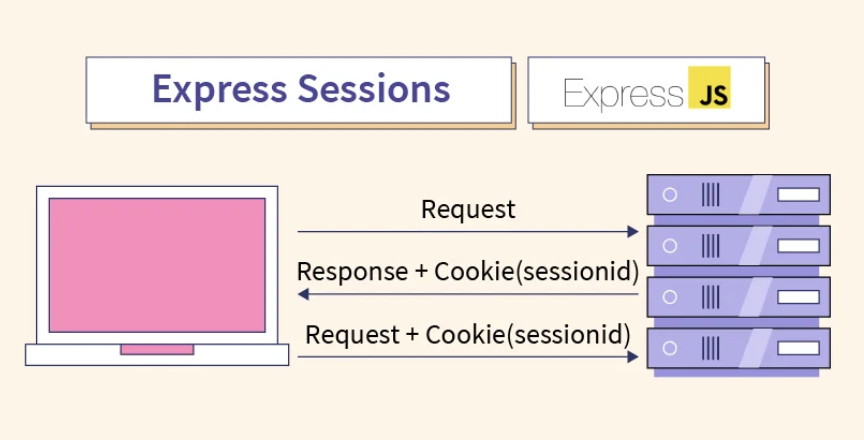
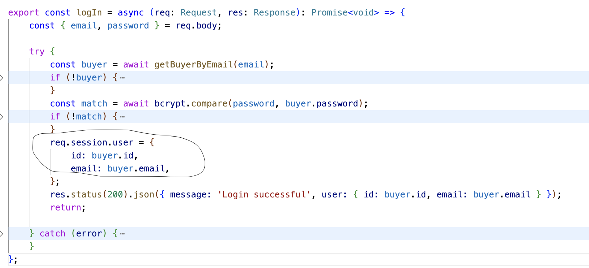

## Guidance
Answer the following questions considering the learning outcomes for
- [Week 07](https://learn.foundersandcoders.com/course/syllabus/developer/week07-project04-authentication/learning-outcomes/)

Make sure to record evidence of your processes. You can use code snippets, screenshots or any other material to support your answers.

Do not fill in the feedback section. The Founders and Coders team will update this with feedback on your progress.

## Assessment
 ### 1. Show evidence of some of the learning outcomes you have achieved this week.
- This week, I did extensive **research on database options and related dependencies**. I now have an understanding of why express-session and connect-sqlite3 are the best choices for managing sessions in our project: simple integration, allows sessions to persist across server restarts, straightforward to set up and configure, uses a session secret to sign cookies, sessions are stored on the server rather than on the client. 


- I **set up backend endpoints for signup, login, and logout**, creating controllers that connect the database to frontend requests and send responses back to the client. Each login response includes session data, which is now stored in our SQLite database.


- I learned the **purpose of cookies**: session management, personalization, security, and tracking user interactions. In the frontend, setting "credentials: 'include'" and In the backend, setting "credentials: true" - ensures the session cookie is maintained across requests, allowing **persistent sessions between the client and server**. 
Frontend:
```
const response = await fetch(endpoint, {
				method: 'POST',
				headers: {
					'Content-Type': 'application/json',
				},
				credentials: 'include',
				body: JSON.stringify(body),
			});
```
Backend:
```
app.use(cors({
  credentials: true,
}));
```

- I **configured the session store** with specific parameters for the database path, session table, and storage location. This setup helps ensure that session IDs and session data are stored persistently and in a structured way within our database.
```
store: new SQLiteStore({
      table: 'sessions',
      db: 'crafts_db',
      dir: dbPath,
  }) as session.Store,
```

- After researching security best practices, I started to incorporate **security-focused thinking** into my tasks. I opted to store sessions in the database (since database sessions can be encrypted, backed up, and securely managed), create sessions only after a verified login, and define user roles at signup for future authorization use.

- I **generated a session_secret key** using Node’s crypto library to enhance session security. This secret key protects against session hijacking by validating session IDs, making it much harder for unauthorized users to access or alter session data.
```
app.use(session({
  store: new SQLiteStore({
      table: 'sessions',
      db: 'crafts_db',
      dir: dbPath,
  }) as session.Store,
  secret: process.env.SESSION_SECRET || 'fallback-secret-key',
  resave: false,
  saveUninitialized: false,
  cookie: {
      maxAge: 1000 * 60 * 60 * 24,
      secure: false, // Set to true if you're using HTTPS in production
      httpOnly: true,
      sameSite: 'lax',
  }
}));
```

- I learned about **password hashing and its importance**. Hashing transforms passwords into complex strings, and with added salting (adding random data), it ensures each hashed password is unique and secure.
```
const hashedPass = await bcrypt.hash(password, 12);
// "f52fbd32b2b3b86ff88ef6c490628285f482af15ddcb29541f94bcf526a3f6c7"
```

 ### 2. Show an example of some of the learning outcomes you have struggled with and/or would like to re-visit.
-  I initially **struggled with defining the session store** in our database. I relied on documentation without fully understanding how to adapt it to our setup. After finding a useful GitHub article, I was able to configure it correctly by setting the dir path, database name, and session table explicitly.
```
store: new SQLiteStore({
      table: 'sessions',
      db: 'crafts_db',
      dir: dbPath,
  }) as session.Store,
```
## Feedback (For CF's)
> [**Course Facilitator name**]  
> [*What went well*]  
> [*Even better if*]
