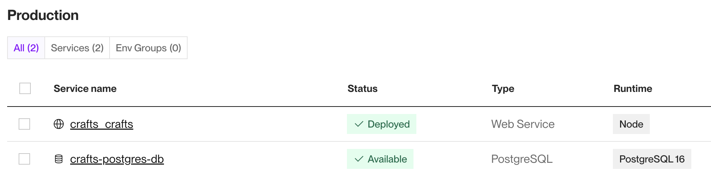
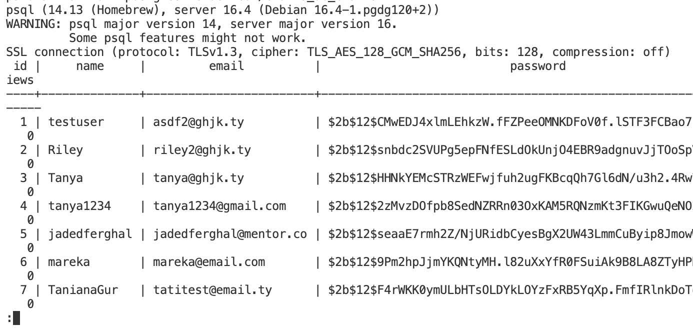

## Guidance
Answer the following questions considering the learning outcomes for
- [Week 08](https://learn.foundersandcoders.com/course/syllabus/developer/week08-project04-test-deploy/learning-outcomes/)

Make sure to record evidence of your processes. You can use code snippets, screenshots or any other material to support your answers.

Do not fill in the feedback section. The Founders and Coders team will update this with feedback on your progress.

## Assessment
 ### 1. Show evidence of some of the learning outcomes you have achieved this week.
- This week, I revisited deployment processes, specifically deploying a backend on Render.com. I was surprised by how user-friendly and straightforward it was compared to AWS. It was also educational to consider the advantage of having both the backend and database hosted in the same environment.


- Expanding on the above point, I learned that Render also supports hosting databases within the same environment as the backend. Consequently, we migrated from SQLite to PostgreSQL, a process that turned out to be relatively simple, as PostgreSQL was similar to SQLite. Configured the 'pg' PostgreSQL package in Node.js to establish database connectivity, creating a connection pool with a secure URL. This configuration enabled seamless backend-database integration.
```ts
const pool = new Pool({
    connectionString: process.env.DB_URL,
   ssl: {
    rejectUnauthorized: false,
   },
});

pool.connect()
    .then(() => console.log('Connected to Postgres on Render'))
    .catch((err: unknown) => {
    if (err instanceof Error) {
        console.error('DB connection error: what', err.message);
    } else {
        console.error('DB connection error:', err);
    }
    });

export default pool;
```

- An interesting aspect was the difference in local and remote database access. With SQLite, I could view database data directly from my local repository. However, with PostgreSQL on Render, this wasn’t possible within the local repo and  I couldn’t monitor database activities on Render as well. Learning to work around this was valuable: I installed PostgreSQL locally and used the terminal command `psql <secret_link_from_render_on_db>` to open a direct communication channel with the database. This allowed me to query tables, view data, and monitor session changes when users logged in.


- Wrote backend documentation, detailing folder structure and providing an overview of registration and login processes involving session management.
```
AUTHENTICATION ENDPOINTS

Sign-Up user:

- Endpoint: POST /auth/sign-up
- Example request: `http://localhost:3000/auth/sign-up`
- Description: Registers a new user with a username, email, and password.
- Parameters(in request body):
  - username (string): The user’s username.
  - email (string): The user’s email address.
  - password (string): The user’s password.

- Response:
  - 201 OK: Returns a message: 'User created successfully. Please log in.'
  - 500 Internal Server Error: Returns an error message: 'Server error, unable to create user.'
```

 ### 2. Show an example of some of the learning outcomes you have struggled with and/or would like to re-visit.
- We encountered issues when integrating the deployed versions of the frontend, backend, and database after completing all database testing. We spent some time identifying the root cause and, without resorting to ChatGPT or Google, managed to resolve it using console.log for debugging. I’m pleased with our persistence and success in troubleshooting independently.

## Feedback (For CF's)
> [**Course Facilitator name**]

Alexander

> [*What went well*]

Strong understanding of deployment differences between platforms (Render vs AWS). Good documentation of database migration process from SQLite to PostgreSQL with clear code examples. Excellent API documentation with detailed endpoint specifications.

> [*Even better if*]

Document the specific integration issues you encountered after deployment and show the console.log debugging process that helped solve them, since you mentioned this was a key learning experience.
