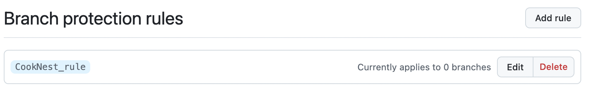

## Guidance
Answer the following questions considering the learning outcomes for
- [Week 010](https://learn.foundersandcoders.com/course/syllabus/developer/week10-project05-DOTNET-intro/learning-outcomes/)

Make sure to record evidence of your processes. You can use code snippets, screenshots or any other material to support your answers.

Do not fill in the feedback section. The Founders and Coders team will update this with feedback on your progress.

## Assessment
 ### 1. Show evidence of some of the learning outcomes you have achieved this week.
 - This week, I explored C# and .NET and completed a workshop. The workshop itself was clear, but I realized many unique aspects of C# and .NET require hands-on experience to grasp and master fully. 
 ```
 builder.Services.AddEndpointsApiExplorer();
builder.Services.AddSqlite<PizzaDb>(connectionString);
builder.Services.AddSwaggerGen(c =>
{
     c.SwaggerDoc("v1", new OpenApiInfo { 
        Title = "PizzaStore API", 
        Description = "Making the Pizzas you love", 
        Version = "v1" });
});
```
 - Since I was working on the front end for our application this week, I found out that the good alternative to the FEtch API is now exist: Axios - a JavaScript library for making HTTP requests. It has few prons: provides a cleaner and more concise syntax, automatically transforms the response data into JSON, automatically throws an error for responses with a status code outside the 2xx range (e.g., 404 or 500), and  supports request and response interceptors, which allow you to modify requests or responses globally. This is extremely useful for adding authentication tokens or logging.
 ```
 export const signup = async (name: string, email: string, password: string) => {
  return axios.post(`${API_URL}/signup`, { name, email, password });
 };
```
 - I refreshed my React knowledge. A new concept for me was the use of useContext, which I’ve just started exploring and am finding really promising. The idea of passing data through the component tree without manually passing props down at every level is a game-changer.
 ```
 return (
    <AuthContext.Provider value={{ user, login, signup, logout }}>
      {children}
    </AuthContext.Provider>
  );
 ```
 - After team discussions and online research, I understood that the best approach is to deploy the backend and database separately. The backend needs to be internet-accessible, but the database should not be. Users should never directly communicate with or access the database.

 ### 2. Show an example of some of the learning outcomes you have struggled with and/or would like to re-visit.
- I faced challenges with styling on the front end. I decided to move away from Tailwind CSS and stick with plain CSS. Tailwind felt overly verbose, as adding all the styles directly as class names made the code cluttered and harder to read.
```
body {
    font-family: var(--font-family);
    font-size: var(--font-size-base);
    color: var(--primary-color);
    padding: var(--padding-base);
    line-height: 1.6;
    background-color: var(--background);
}
```
- I struggled to understand GitHub branch protection rules. I managed to set up protection for the frontend repo, but I feel like it was more of an intuitive guess than a properly informed implementation.


## Feedback (For CF's)
> [**Course Facilitator name**]  
> [*What went well*]  
> [*Even better if*]
